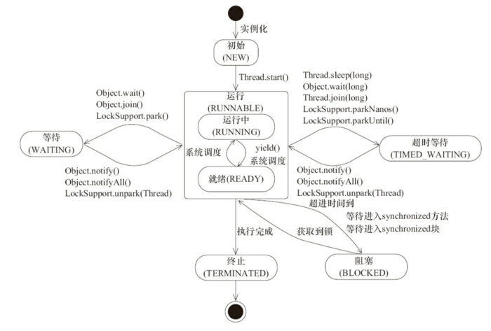

#新建线程

##1、用户创建线程有三种方式：

    1.通过继承Thread类，重写run方法;
    2.通过实现runable接口;
    3.通过实现callable接口;
    4.通过线程池创建
    
- runable,callable 优缺点：线程类实现了Runable接口或者Callable接口，还可以继承别的类，但要访问当前线程，则必须使用Thread.currentThread()方法。
- Thread 优缺点：直接使用this即可获得当前线程，但线程类已经继承了Thread类，所以不能再继承其他父类。
- FutureTask接口实现关系

##2、线程状态转换
2.1、线程状态
    
    1.New:初始状态，线程被构建，但是还没有调用start()方法
    2.Runnable:运行状态，Java线程将操作系统中的就绪和运行状态统称为"运行中"
    3.Blocked:阻塞状态，表示线程阻塞于锁
    4.Waiting:等待状态，表示线程进入等待状态，进入该状态表示当前线程需要等待其他线程
    5.Time_waiting:超时等待状态，该状态不同于WAITING,它是可以指定的时间自行返回
    6.Terminated:终止状态，标识当前线程已经执行完毕

2.2 线程状态转换

##3、线程状态基本操作

3.1 wait()与sleep()比较:

- sleep是Thread的静态方法，而wait是Object实例方法
- 调用sleep()方法会将当前线程暂停执行指定的时间，将执行机会（CPU）让给其他线程，但对象的锁依然保持，休眠结束依然会自动恢复。
- 调用wait()方法导致当前线程放弃对象的锁（线程暂停执行），进入对象的等待池（wait pool）,只有调用对象的notify方法（或者notifyAll()方法）
才能唤醒等待池中的线程进入等锁池（lock pool）,如果线程重新获得对象的锁，就可以进入就绪状态。
    
    
    Thread类
    public static native void sleep(long millis) throws InterruptedException;
    Object类
    public final native void wait(long timeout) throws InterruptedException;

3.2 wait()与yeild()比较
- sleep()方法会给低优先级的线程以运行的机会，yield()方法只会给相同优先级或更高优先级的线程以运行的机会
- 线程执行sleep()方法后转入阻塞（blocked）状态，而执行yield方法后转入ready状态
- sleep()方法声明抛出InterruptedException，而yield没有声明任何异常。
- sleep()方法比yield()方法更具有很好的可移植性。

3.3 中断interrupted

- 线程可以调用该线程的interrupt()方法对其进行中断操作，同时该线程可以调用 isInterrupted（）来感知其他线程对其自身的中断操作，从而做出响应。
- 同样可以调用Thread的静态方法 interrupted（）对当前线程进行中断操作，该方法会清除中断标志位。需要注意的是，当抛出InterruptedException时候，会清除中断标志位，也就是说在调用isInterrupted会返回false。

3.4 join
- 线程间协作的一种方式。如果一个线程实例A执行了threadB.join(),其含义是：当前线程A会等待threadB线程终止后threadA才会继续执行。

